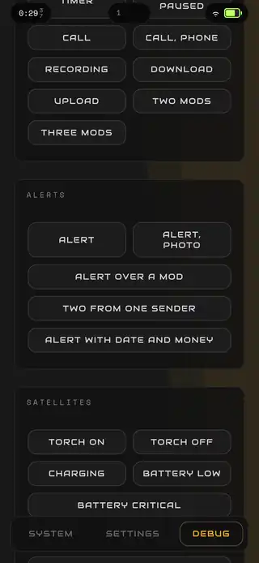

# Dynamic Bubble

A system overhaul for One UI. It takes the status bar off the screen and puts individual bubbles in its place, then carries those bubbles into the notification shade, quick settings and the lock screen's Now Bar, so the top of the phone becomes one animated piece instead of four separate ones.

Built for one phone: a Samsung Galaxy S25 (SM-S931B) on One UI 8 / Android 16. It is sideloaded and has not been tried on anything else.

## Showcase

  
  

Recorded on the S25. Click a clip for the full-quality video.

## Why it exists

One UI answers every event with its own piece of interface. A song gets a media chip, a timer gets a notification row, a message gets a heads-up card that drops over whatever is open, and the clock and icons sit in a bar that knows nothing about any of them. The shade and quick settings are another world again. Each part is designed on its own and animates on its own terms, so the phone feels like a stack of unrelated overlays.

Dynamic Bubble folds all of that into one component at the camera cutout. There is one place to look and one set of rules for how anything moves. When a song starts, the bubble widens to carry it. When a timer runs as well, the two share it. When a message lands, it grows out of the same bubble instead of dropping in from the top.

It is heavily animated on purpose. A phone gets glanced at for half a second, and in that half second motion says more than text: a bubble growing means something arrived, the direction tells you what it belongs to, the way it leaves tells you it is done. Every movement has a cause, and everything moves the same way, which keeps it lively without turning into noise.

## What it does

- **Main bubble at the cutout.** Carries whatever is currently true: music with album art and live bars, a running timer, a Discord call. When several are true at once, the extras split off as small circles beside it, and a sideways swipe rotates which one leads.
- **Alerts.** Incoming notifications grow out of the bubble in the app's own colour, stay for a few seconds and fold back. One UI's heads-up pop-ups are switched off, so nothing is announced twice. Anything a notification blocker such as BuzzKill kills, or Do Not Disturb filters, never shows up.
- **Clock and Now mods.** The clock on the left is drawn by the same page. When the torch is on or something is recording, the clock hands its place over to that.
- **Status bubble.** Battery, connectivity, transfers and the charging cable live in one bubble on the right. Plugging in or running low is announced there, where the charge already is.
- **Dashboard.** Tap the Status bubble and it opens into the quick settings: brightness and volume, toggles for Wi-Fi, mobile data, Bluetooth, hotspot, GPS, airplane mode, power saving, rotation, microphone access and more, a battery reading to two decimals, weather, storage and memory.
- **Notifications menu.** Swipe down on the main bubble and it opens into every notification the shade holds. Tap a row to open the app, swipe it sideways to dismiss it everywhere.
- **Lock screen Now bubble.** Stands in for One UI's Now Bar, built from the same pieces as everything else, so the lock screen does not switch to a different design language.
- **Landscape.** The bar stays out of the way in games and videos until you swipe down on the top edge or tap the top-left corner.
- **Screen off.** A notification wakes the screen long enough to play its arrival. Otherwise the bubbles disappear with the screen, so nothing burns into the OLED overnight.

## What you need

### Required

- **Shizuku.** Replacing a system feature means switching the original off, and Android does not let a normal app do that. Suppressing the pop-ups, hiding the status bar, the microphone access toggle and the hotspot all need shell rights. Shizuku gives those without root, so the phone stays on stock firmware.
- **Wireless debugging** (Developer options). Shizuku is started over it, and Dynamic Bubble pairs with it once itself. After that it restarts Shizuku on its own after a reboot or after a USB mode change kills it, so you don't have to start it by hand again.
- **Accessibility and notification access** for Dynamic Bubble. Accessibility is what lets the bubble sit above the status bar and still be touchable. Notification access is how it sees what arrives. The app reads window events only, not screen content.

### Optional: Good Lock

- **QuickStar.** Use it to hide everything One UI draws in the status bar (clock, icons, chips), so the bubbles are the only thing up there. Dynamic Bubble can also hide the bar on its own (System screen → *Status bar*).
- **One Hand Operation +.** Dynamic Bubble adds two launcher entries, **VADOS Panel** (the Dashboard) and **VADOS Notifications** (the Notifications menu). Assign them to side-edge gestures in One Hand Operation + and you can open either with your thumb from anywhere without reaching for the top of the screen.

## Setup

1. Install the APK and open **VAD/OS - Bubble**. The control panel lists every permission with its live state and a button to grant it.
2. Turn on **accessibility** and **notification access**. If Android greys a toggle out as *Restricted setting*, open App info → ⋮ → *Allow restricted settings* and try again. From a computer, `grant.ps1` does all of this over adb in one go.
3. Install **Shizuku**, start it through Wireless debugging, and grant Dynamic Bubble access on the panel's System screen.
4. On the same screen, pair **Wireless debugging** once. From then on Shizuku is brought back automatically.
5. Optionally set up QuickStar and One Hand Operation + as described above.

## Using it

| Where | Gesture | What happens |
|---|---|---|
| Main bubble | Tap | Opens whatever it carries (the player, the timer). A bare bubble opens the Notifications menu. |
| Main bubble | Hold | Opens the app behind it: Spotify for music, the clock app for a timer, Discord for a call. |
| Main bubble | Swipe down | Notifications menu, whatever the bubble is carrying. |
| Main bubble | Swipe sideways | Brings the next circle to the front. |
| Alert | Tap / swipe up | Opens the app / dismisses the alert. |
| Status bubble | Tap | Dashboard. |
| Anywhere outside | Tap | Closes whatever is open. |

## Further reading

[INSTRUCTIONS.md](INSTRUCTIONS.md) is the long form: every state, why each gesture belongs where it does, what the platform forced, the debug hooks, and the device measurements. The rules the code follows are in `.claude/rules/`.
